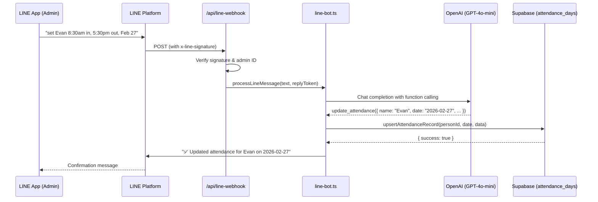

# LINE Bot Integration Documentation

**Module Path**: `/api/line-webhook`  
**Primary Files**:
- `app/src/app/api/line-webhook/route.ts`: Webhook receiver & signature verification.
- `app/src/app/actions/line-bot.ts`: Core bot logic (OpenAI + Supabase).

---

## 1. Overview

The LINE Bot allows authorized administrators to manage attendance records via natural language messages sent through the LINE messaging app.

**Example message:**
> "set Evan 8:30am check in and 5:30pm check out for February 27"

**What happens:**
1. LINE sends the message to our webhook.
2. OpenAI extracts the structured data (employee name, date, times).
3. The bot calls `upsertAttendanceRecord` — the exact same function used by the Admin Dashboard.
4. A confirmation is sent back to LINE.

### Architecture Flow



---

## 2. Environment Variables

All keys are stored in `app/.env.local`:

| Variable | Source | Purpose |
|---|---|---|
| `LINE_CHANNEL_ACCESS_TOKEN` | LINE Developer Console → Messaging API | Allows the app to send replies back to LINE |
| `LINE_CHANNEL_SECRET` | LINE Developer Console → Basic Settings | Verifies incoming webhooks are from LINE (HMAC-SHA256) |
| `OPENAI_API_KEY` | [platform.openai.com](https://platform.openai.com) | Powers the natural language understanding |
| `AUTHORIZED_LINE_ADMINS` | LINE Developer Console → Basic Settings → "Your user ID" | Comma-separated list of LINE user IDs allowed to use the bot |

---

## 3. Files & Logic

### 3.1. `route.ts` — Webhook Receiver

**Path**: `app/src/app/api/line-webhook/route.ts`

Handles `POST` requests from the LINE platform.

**Steps:**
1. **Signature Verification**: Computes HMAC-SHA256 hash of the request body using `LINE_CHANNEL_SECRET` and compares it against the `x-line-signature` header. Rejects the request if they don't match.
2. **Event Parsing**: Extracts the events array from the LINE webhook payload.
3. **Admin Check**: Compares the sender's `userId` against `AUTHORIZED_LINE_ADMINS`. Unauthorized users are silently ignored.
4. **Forwarding**: Passes the text message to `processLineMessage()` in `line-bot.ts`.

### 3.2. `line-bot.ts` — Core Bot Logic

**Path**: `app/src/app/actions/line-bot.ts`

Contains two main functions:

#### `processLineMessage(text, replyToken, userId)`
1. **Rate Limiting**: Enforces a 3-second cooldown per user.
2. **OpenAI Call**: Sends the text to GPT-4o-mini with a system prompt and a single tool definition (`update_attendance`).
3. **Tool Call Handling**: If OpenAI returns a function call, extracts the arguments and calls `handleAttendanceUpdate()`. Only the first tool call is processed.
4. **Reply**: Sends the result (success/error) back to the user via LINE.

#### `handleAttendanceUpdate(args)`
1. **Date Validation**: Rejects dates more than 60 days from today.
2. **Employee Search**: Queries `people` table using `ilike` for case-insensitive partial match on `full_name`.
3. **Ambiguity Check**: If multiple employees match, asks the user to be more specific.
4. **Time Conversion**: Converts `HH:mm:ss` → full ISO timestamp (`YYYY-MM-DDTHH:mm:ss+09:00`).
5. **Database Update**: Calls `upsertAttendanceRecord` (from `attendance-actions/actions.ts`) — the same function used by the Monthly Attendance Report's edit feature.

---

## 4. OpenAI Function Schema

The bot provides OpenAI with exactly **one** tool:

```json
{
  "name": "update_attendance",
  "parameters": {
    "employee_name_query": "string — employee name to search",
    "date": "string — YYYY-MM-DD format",
    "check_in_at": "string — HH:mm:ss (24-hour), optional",
    "check_out_at": "string — HH:mm:ss (24-hour), optional",
    "status": "enum: 'present' | 'absent'"
  },
  "required": ["employee_name_query", "date", "status"]
}
```

**Important**: The `status` field maps to the `attendance_status` database enum. The valid values are `present` and `absent`. Shift types like `flex`, `paid_leave`, `business_trip` etc. are separate and come from the `shifts` table — they are NOT set by this bot.

---

## 5. Security Safeguards

| Layer | Implementation | Purpose |
|---|---|---|
| **Signature Verification** | HMAC-SHA256 check in `route.ts` | Ensures requests actually come from LINE |
| **Admin ID Whitelist** | `AUTHORIZED_LINE_ADMINS` env var | Only your LINE account can use the bot |
| **Rate Limiting** | 3-second cooldown per user in `line-bot.ts` | Prevents accidental request spam |
| **One Record Per Message** | AI system prompt + code enforcement | Cannot bulk-update multiple employees at once |
| **No Delete Capability** | No delete tool is provided to the AI | Records can only be added/updated, never deleted via LINE |
| **Date Range Check** | 60-day window validation | Prevents accidental edits to ancient records |
| **Ambiguous Name Detection** | Returns up to 5 matches, asks for clarification | Prevents updating the wrong employee |
| **No Database Reading** | AI instructed it cannot list or read data | Bot cannot expose employee data |

---

## 6. Database Interaction

The bot **only** interacts with the `attendance_days` table via the existing `upsertAttendanceRecord` server action. It uses `createAdminClient()` (service role key) to bypass RLS since webhook requests have no user session cookies.

**What it CAN do:**
- Insert a new attendance record (if none exists for that employee + date).
- Update an existing attendance record (if one already exists for that employee + date).

**What it CANNOT do:**
- Delete any records.
- Modify shifts, system events, people, or any other table.
- Read or list any data from the database.

---

## 7. Dependencies

Installed via `npm install` in the `app/` directory:

| Package | Version | Purpose |
|---|---|---|
| `@line/bot-sdk` | Latest | LINE Messaging API client (signature verification, message sending) |
| `openai` | Latest | OpenAI API client (chat completions with function calling) |

---

## 8. Local Development Setup

### Prerequisites
- LINE Developer Console account with a Messaging API channel.
- OpenAI API key.
- All environment variables set in `app/.env.local`.

### Testing Locally

1. Start the Next.js dev server:
   ```bash
   cd app && npm run dev
   ```

2. In a **separate terminal**, expose your local server using ngrok:
   ```bash
   npx ngrok http 3000
   ```

3. Copy the ngrok forwarding URL (e.g., `https://abc123.ngrok-free.app`).

4. In the LINE Developer Console → Messaging API tab:
   - Set **Webhook URL** to: `https://abc123.ngrok-free.app/api/line-webhook`
   - Enable **Use webhook**.
   - Disable **Auto-reply messages**.

5. Add the bot as a friend (scan QR code in the console).

6. Send a test message like: `"set Evan 8:30am in and 5:30pm out for today"`

> **Note**: On the free ngrok plan, the URL changes every time you restart ngrok. You must update the LINE webhook URL each time.

---

## 9. Production Deployment (Vercel)

When deployed to Vercel:

1. Add the environment variables (`LINE_CHANNEL_ACCESS_TOKEN`, `LINE_CHANNEL_SECRET`, `OPENAI_API_KEY`, `AUTHORIZED_LINE_ADMINS`) to your Vercel project settings.

2. Set the LINE webhook URL to your permanent domain:
   ```
   https://your-domain.vercel.app/api/line-webhook
   ```

3. No ngrok needed — Vercel provides a permanent public URL.

---

## 10. Example Messages

| Message | AI Extracts | Result |
|---|---|---|
| "set Evan 8:30am in and 5:30pm out for Feb 27" | name: Evan, date: 2026-02-27, in: 08:30:00, out: 17:30:00 | ✅ Inserts/updates record |
| "Mariko was absent yesterday" | name: Mariko, date: (yesterday), status: absent | ✅ Marks absent |
| "add 9am check in for Evan today" | name: Evan, date: (today), in: 09:00:00 | ✅ Updates check-in only |
| "delete Evan's record for Feb 27" | — | ❌ Refused (no delete tool) |
| "list all employees" | — | ❌ Refused (no read capability) |
| "set everyone to absent" | — | ❌ Refused (one employee at a time) |

---
*Documentation generated by Evan. Last updated: 2026-02-26.*
